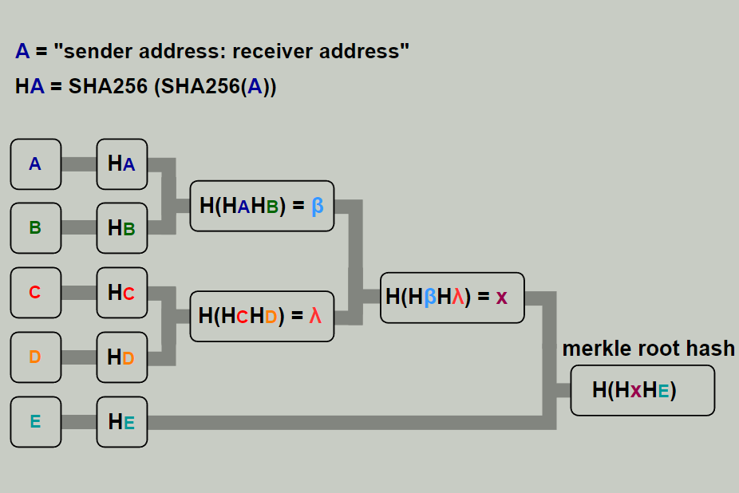

## Libraries

**sha256** → [https://github.com/okdshin/PicoSHA2](https://github.com/okdshin/PicoSHA2)   
**json** → [https://github.com/nlohmann/json](https://github.com/nlohmann/json)   
**boost** → [www.boost.org](https://www.boost.org/) (>1.66)  

### Peer-to-peer   
A peer-to-peer (P2P) network is a decentralized type of network in which each participant can act as both a client and a server. This means that each node is able to communicate directly with other nodes and share resources (in this case blocks), without the need for a central server or authority that controls the network or manages the flow of information. Instead, each node is equal and has the same rights (just like voting). This makes P2P architecture highly resilient, as there is no single point of failure that can bring down the entire network.   
   
   
   
### Mempool
Mempool is constantly listening for new votes (like ballot box) until deadline is reached. Deadline is the end of voting time set before start.    
When reached, mempool closes for new votes and waits for the accumulated pool of votes to be closed in blocks.   
   
   
    
### Mining
Mining is about finding nonce. Node must encapsulate accumulated votes in block by hashing block header which includes:   
    
<**block header**>   
- id
- merkle root hash of all votes in block
- previous block hash
- timestamp
- nonce

</**block header**>    
    
Node increments nonce until hash of block matches target.     

    
   
   
### Block mined, what's next?   
After finding the correct nonce and mining the block, node must send it to its peers.   
   
   
   
If node has received a block, it must verify its authenticity.    
First it checks if "previous block hash" of received block header points on last block in its own chain.

```mermaid
graph RL
B[Last block -2]
B1[Last block -1]
B2[Last block]
RB[Received Block] -- prev. hash--> B2
B2 -- prev. hash--> B1
B1 -- prev. hash--> B
```
   
If not, node asks peers about lenght of the chain (longest chain is valid because of amount of work that is needed to mine all blocks) and if owned chain is shorter than longest it asks peers for sending missing block(s). But if lenght of owned chain is the longest and received block points on non-existing block it is rejected by the node.   

However, if previous block hash points on last block in chain owned by node, it starts verifing votes included in received block by hashing txids until merkle root hash.   
    
### [Merkle root](https://learnmeabitcoin.com/technical/merkle-root)   
   
   
   
If merkle root hash is not correct block is rejected, otherwise node verify block hash by hashing whole header.    
If block hash is not correct block is rejected, otherwise is added to chain. Node must erase votes of added block from mempool.   
