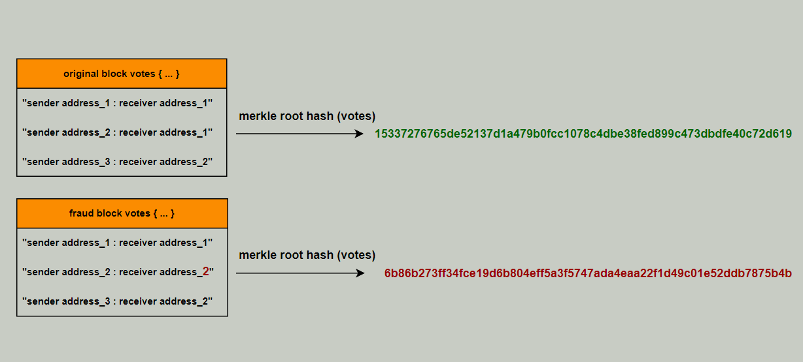

## Libraries
     
**Base58** → [https://gist.github.com/miguelmota/ff591873da4f76393ce48efe62d49fd1](https://gist.github.com/miguelmota/ff591873da4f76393ce48efe62d49fd1)       
**secp256k1** → [https://github.com/bitcoin-core/secp256k1](https://github.com/bitcoin-core/secp256k1)     
**sha256** → [https://github.com/okdshin/PicoSHA2](https://github.com/okdshin/PicoSHA2)   
**json** → [https://github.com/nlohmann/json](https://github.com/nlohmann/json)   
**boost** → [https://www.boost.org](https://www.boost.org)     
    

### Usage     
Linux: make      
macOS: make macOS
      
Configure mempool_config.json and checker_config.json     
command: date +%s to get time in unix time, copy it to "deadline" field in config files. Add as many seconds as you want the voting to last and save both files.      
Now you can run ./checker and ./node.      
To run client program ./voter you need to pass 6 arguments exactly in that order:      
./voter email password name surname id choice      
example:     
samplemail1@gmail.com password1 name1 surname1 1 alice      
In whitelist file must be a hash value of these inputs. For example above:       
{      
     "email" : "ce5d0b9c38390690e96077bc70a43d8c90580a8e617d6cb12bb0c2163d389b1c",      
     "password" : "0b14d501a594442a01c6859541bcb3e8164d183d32937b851835442f69d5c94e",      
     "name" : "9367417d63903350aeb7e092bca792263d4fd82d4912252e014e073a8931b4c1",      
     "surname" : "0089f26a4132d4baca9a1f5b206b50bf80791df2f55ecbd9c7e0ff3dcff3303d",      
     "id" : "6b86b273ff34fce19d6b804eff5a3f5747ada4eaa22f1d49c01e52ddb7875b4b"      
}      

   
### Mempool
Mempool is constantly listening for new votes (like ballot box) until deadline is reached. Deadline is the end of voting time set before start. When reached, mempool closes for new votes and waits for the accumulated pool of votes to be closed in blocks.   
   
   
    
### Mining
Mining is about finding nonce. Node must encapsulate accumulated votes in block by hashing block header which includes:   
    
<**block header**>   
- id
- merkle root hash of all votes in block
- previous block hash
- timestamp
- nonce

</**block header**>    
    
Node increments nonce until block hash matches target.     

    
   
   
    
### [Merkle root](https://learnmeabitcoin.com/technical/merkle-root)   
   
   
   
If merkle root hash is not correct block is rejected, otherwise node verify block hash by hashing whole header.    
If block hash is not correct block is rejected, otherwise is added to chain. Node must erase votes of added block from mempool.   

### Fraud protection    
   
  
    
    
Any change in votes included in block completely changes merkle root hash, which changes block header.   
    
    
   
    
    
Block hash changes completely, meaning that the next block's "previous hash" pointer is invalid and needs to be changed. This causes the headers of all subsequent blocks to change and have to be mined again.
